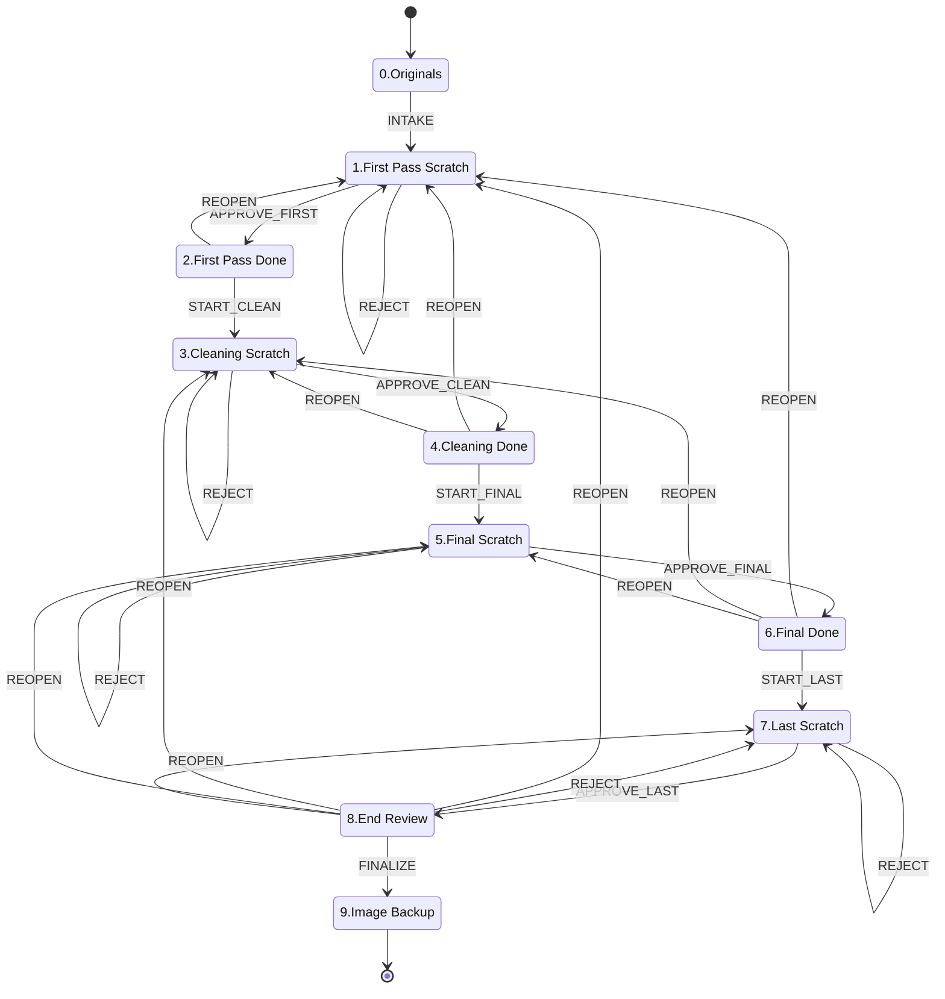

# Pipeline state diagram (generated)

**Generated by `tools/lw_diagram.py` from `tools/lw_pipeline.py`'s own
constants. Do not hand-edit** - `tests/test_pipeline_diagram.py` compares
this file byte-for-byte against a fresh generation, and fails if
`lw_pipeline.py` grows a transition verb this diagram does not draw.
Regenerate with:

```
python tools/lw_diagram.py --write
```

Every node is a real folder under `images\` (ADR-003) and every edge is a
transition `lw_pipeline.py` actually logs to `PIPELINE_LOG.md`. The prose
map in `docs/ARCHITECTURE.md` stays the reference for what each folder
HOLDS; this is the reference for how an image MOVES.

## The ladder



## States

| node | folder |
| --- | --- |
| `ORIGINALS` | `0.Originals` |
| `FIRST_SCRATCH` | `1.First Pass Scratch` |
| `FIRST_DONE` | `2.First Pass Done` |
| `CLEAN_SCRATCH` | `3.Cleaning Scratch` |
| `CLEAN_DONE` | `4.Cleaning Done` |
| `FINAL_SCRATCH` | `5.Final Scratch` |
| `FINAL_DONE` | `6.Final Done` |
| `LAST_SCRATCH` | `7.Last Scratch` |
| `END_REVIEW` | `8.End Review` |
| `BACKUP` | `9.Image Backup` |

## Edges

| op | from | to |
| --- | --- | --- |
| `INTAKE` | `0.Originals` | `1.First Pass Scratch` |
| `APPROVE_FIRST` | `1.First Pass Scratch` | `2.First Pass Done` |
| `APPROVE_CLEAN` | `3.Cleaning Scratch` | `4.Cleaning Done` |
| `APPROVE_FINAL` | `5.Final Scratch` | `6.Final Done` |
| `APPROVE_LAST` | `7.Last Scratch` | `8.End Review` |
| `START_CLEAN` | `2.First Pass Done` | `3.Cleaning Scratch` |
| `START_FINAL` | `4.Cleaning Done` | `5.Final Scratch` |
| `START_LAST` | `6.Final Done` | `7.Last Scratch` |
| `REJECT` | `1.First Pass Scratch` | `1.First Pass Scratch` |
| `REJECT` | `3.Cleaning Scratch` | `3.Cleaning Scratch` |
| `REJECT` | `5.Final Scratch` | `5.Final Scratch` |
| `REJECT` | `7.Last Scratch` | `7.Last Scratch` |
| `REJECT` | `8.End Review` | `7.Last Scratch` |
| `FINALIZE` | `8.End Review` | `9.Image Backup` |
| `REOPEN` | `2.First Pass Done` | `1.First Pass Scratch` |
| `REOPEN` | `4.Cleaning Done` | `1.First Pass Scratch` |
| `REOPEN` | `4.Cleaning Done` | `3.Cleaning Scratch` |
| `REOPEN` | `6.Final Done` | `1.First Pass Scratch` |
| `REOPEN` | `6.Final Done` | `3.Cleaning Scratch` |
| `REOPEN` | `6.Final Done` | `5.Final Scratch` |
| `REOPEN` | `8.End Review` | `1.First Pass Scratch` |
| `REOPEN` | `8.End Review` | `3.Cleaning Scratch` |
| `REOPEN` | `8.End Review` | `5.Final Scratch` |
| `REOPEN` | `8.End Review` | `7.Last Scratch` |

## What the diagram deliberately does not draw

In-place verbs. These are logged to `PIPELINE_LOG.md` and change the
contents of a folder, not which folder an image is in, so drawing them
would add self-loops to every node and say nothing:

- `ANNOTATE`
- `DELIVER_PICTURES`
- `GC_DONE`
- `REMOVE`
- `SAVE_WORKING`
- `SUBMIT`

`REOPEN` is drawn (10 edges): `reopen --to <stage>` pulls a
slug back to any earlier scratch folder, which is how a finished image
is re-processed. It is the only backward path other than the End Review
demotion.

## Why this is mermaid and not an external diagram tool

The operator queued `tt-a1i/archify` on 2026-09-15 for exactly this
job. The scope answer, recorded in `ROADMAP.md`: the job is real, that
instrument is wrong HERE. Its wrapper is MIT, but the wrapper does not
clear the payload - its own `THIRD_PARTY_NOTICES.md` puts the Vue.js
mark under CC-BY-NC-SA-4.0, embedded as vector-path data, with the
non-commercial and share-alike conditions stated as still applicable
(RSC found it first, 2026-09-16; LW reproduced it independently at the
raw notices file). Anything this tool DREW could therefore carry NC
bytes into a public Apache-2.0 repo. That alone is disqualifying here.
Beyond the licence: its documented install is machine-wide, which
reaches four sibling trees and is therefore a sync-inbox matter rather
than a unilateral one; its output is self-contained HTML, which GitHub
does not render inline, so the diagram would be invisible on the page
where it would be read; and a repo-local install means vendoring about
157 MB into a PUBLIC tree. Mermaid costs no install, stays 7-bit ASCII,
renders natively on GitHub, and - the part that actually matters - can
be generated from the code so it cannot drift.
